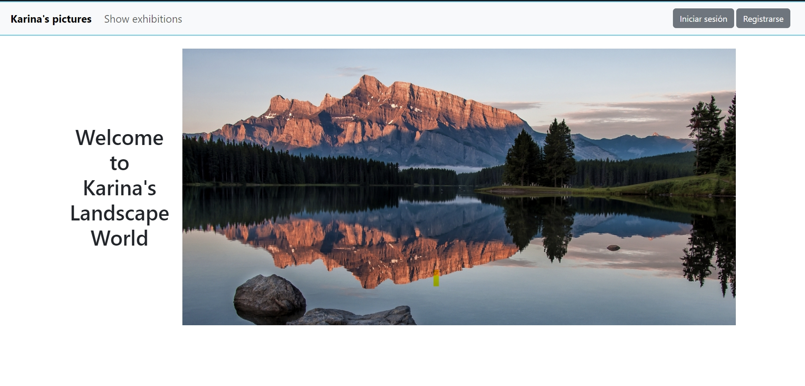
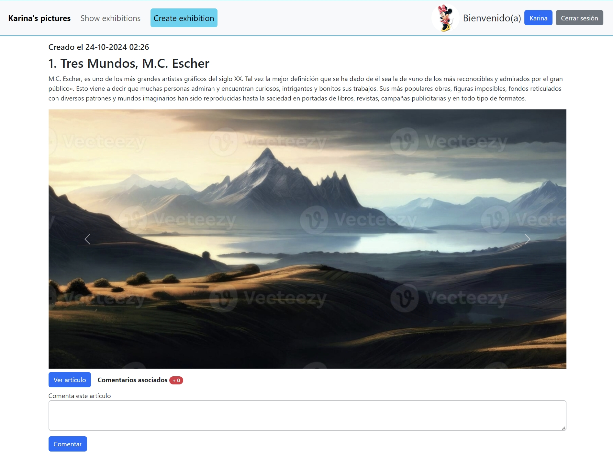
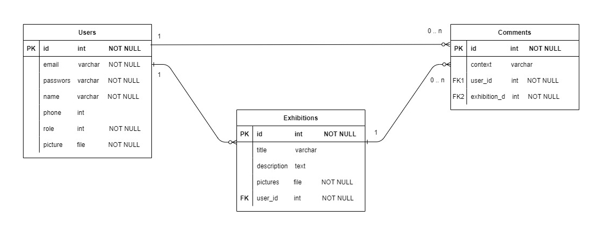

  

# Módulo 6 - Desafío 4
# Carlos Santana

Ruby on Rails - postgresql

## Descripción

Esta aplicación permite, usando el modelo de un blog, publicaciones de una exposición de fotos por parte de un(a) fotógrafo(a) y realizar comentarios de las publicaciones por parte de sus seguidores. Adicionalmente, tiene control de acceso (LogIn, LogOut, SignUp y editUser ) para comentar y requiere cargar la foto del usuario para darse de alta (SignUp).  
En el caso de las imágenes, éstas serán almacenadas en el servicio de almacenamiento de Amazon S3. Para esto se debe tener una cuenta en ese servicio y crear un bucket para tales efectos.  
  
OBS:  
   1. La aplicación permite determinadas vistas según el perfil del usuario (perfil normal, perfil author y perfil admin).  
   2. El usuario, al registrarse, DEBE subir una imagen en su registro.  
   3. Si se desea cambiar los datos del usuario, éste debe hacer click sobre su nombre en la barra de navegación y lo lleva a la vista de modificación.  
   4. Sólo el usuario author puede crear exhibiciones, la que incluye un título, una descripción y de 1 a n fotos por exhibición. Si tiene más de una foto en una exhibición, entonces se activa -automáticamente- un carrusel para ver todas las imágenes.  
   5. Para comentar una exhibición, el usuario debe iniciar sesión.  
   6. Las exhibiciones se muestran en orden descendiente según la fecha de creación del mismo (y se enumeran de más nueva a más antigua).  
   7. No se permite editar la descripción ni modificar las imágenes de una exposición, ya que los comentarios son para la descripción e imágenes originales. Por lo tanto, si se cambia alguno de éstos, los comentarios ya no serán -necesariamente- para las descripción e imágenes editadas.  
   8. El author podrá eliminar exposiciones y sus comentarios asociados, o bien, comentarios individuales asociados a la exposición si éstos son ofensivos.
   9. Las acciones de eliminación sólo son permitidas al usuario author o admin.  
  
## Pantalla de inicio  
  
Vista para todos los usuarios al entrar a la aplicación. Está en /root y permite el inicio de sesión, o bien, el registro para usuarios nuevos.  
  
  
  
## Usuario author  
  
La vista de inicio, una vez iniciada sesión, para el usuario author tiene la opción de crear exbibiciones y administrar las publicaciones acorde a lo indicado en la descripción.  
  
  
  
## Modelo de datos  
  

  
## Inicio
  
Estas instrucciones te ayudarán a obtener una copia del proyecto y a ejecutarlo en tu máquina local para fines de desarrollo y prueba.

### Pre-requisitos
  
Este proyecto fue desarrollado con Ruby versión 3.3.5, Rails - versión 7.2.1.1 y PostgreSQL - versión 16.4

### Instalación
  
Sigue estos pasos para ejecutar el proyecto localmente:
  
1. Clona este repositorio en tu máquina local.  
git clone https://github.com/crsantanag/m6d4.git  
  
2. Navega hasta el directorio del proyecto.  
cd m6d3  
  
3. Instala las dependencias y modifica archivo database.yml  
Las gemas que se deben instalar son:   
   - devise (autenticación)
   - figaro (configuración de variables ENV)  
   - activestorage (almacenamiento de imágenes). Instalar: rails active_storage:install  
   - aws-sdk-s3 (almacenamiento de imágenes en el servicio de Amazon S3)
  
4. Crea la base de datos, realiza la migración y carga los datos de prueba (ejecutar archivo seed.rb)  
    - rails db:create  
    - rails db:migrate  
    - rails db:seed ( seeds.rb tiene la creación del usuario karina@karipic.cl con el rol de author- revisar antes de ejecutar el comando)  
  
## Ejecutando las pruebas
Levanta el servidor y prueba la aplición.  
root está en /  
  
Este proyecto no cuenta con pruebas automatizadas. Puedes probar manualmente todas las funcionalidades.  
  
## Licencia  
  
Este proyecto está bajo la Licencia MIT. Consulta el archivo [LICENSE.md](LICENSE.md) para obtener más detalles.  
  
⌨ ️Carlos Santana (https://github.com/crsantanag)